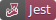
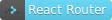
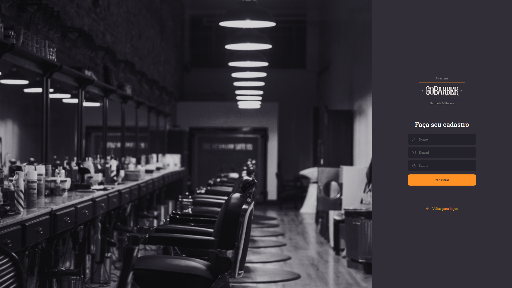
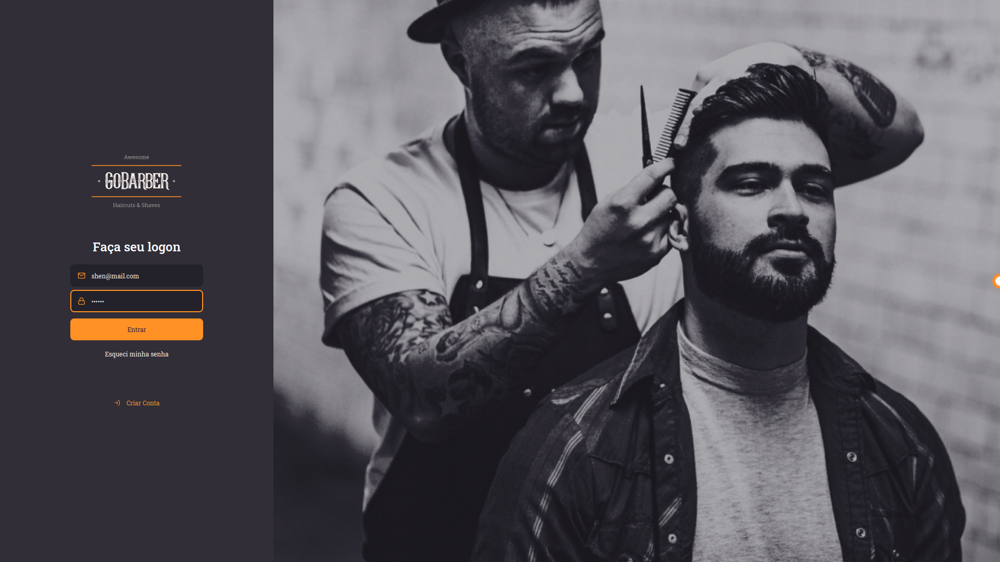
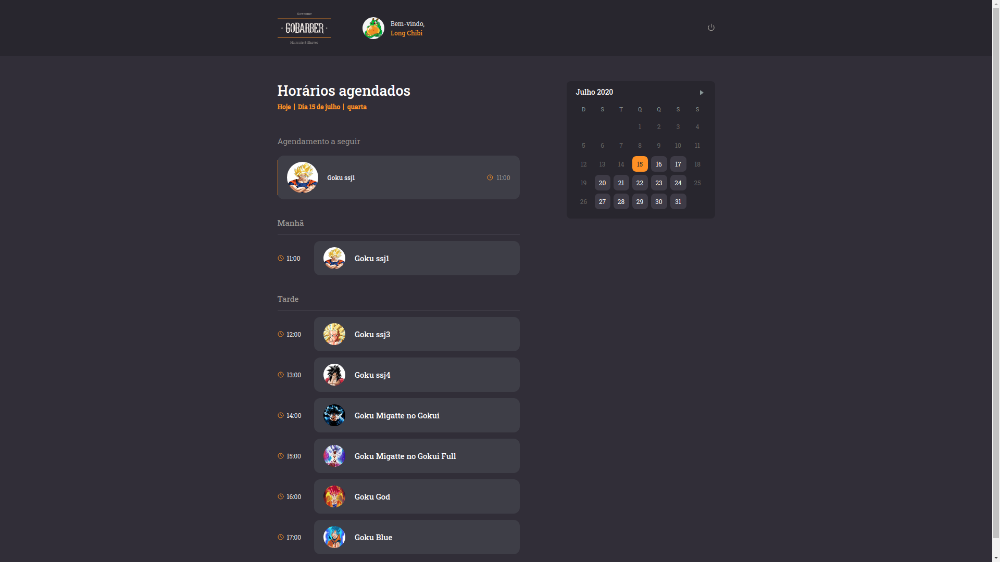
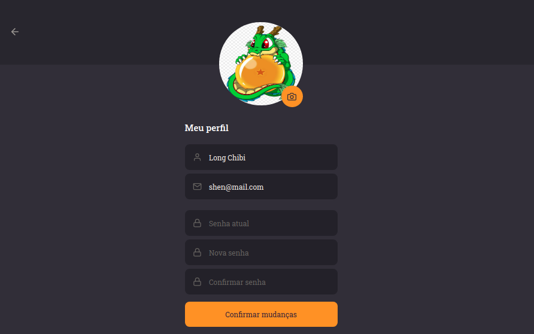
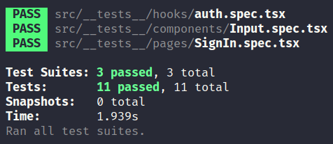

<h1 align="center">
  
</h1>

<p align=center>
  
  
  
  
</p>


## 🔮 Sobre o projeto

Aplicação Web desenvolvida com ReactJS e utilizando TypeScript. Destino ao uso de barbeiros para verificar os horários do seu atendimento aos clientes e atualização do perfil.


## 📚 Tabela de Conteúdo

<!--ts-->
* [🔮 Sobre o projeto](#🔮-sobre-o-projeto)
* [📚 Tabela de Conteúdo](#📚-tabela-de-conteúdo)
* [🛑 Pré-requisitos](#🛑-pré-requisitos)
* [🎲 Como rodar o projeto](#🎲-como-rodar-o-projeto)
* [🎲 Imagens do projeto](#imagens-do-projeto)
  * [Tela de cadastro](#tela-de-cadastro)
  * [Tela de login](#tela-de-login)
  * [Lista de agendamentos](#lista-de-agendamentos)
  * [Tela de perfil](#tela-de-perfil)
* [🛠 Tecnologias](#🛠-tecnologias)
* [🧪 Testes](#🧪-testes)
<!--te-->

## 🛑 Pré-requisitos

- Todos os pré-requisitos do backend
- Ter o backend rodando

## 🎲 Como rodar o projeto

```bash
# Clone este repositório
$ git clone git@github.com:vitorsemidio-dev/gobarber-ts-web.git

# Acesse a pasta do projeto no terminal/cmd
$ cd gobarber-ts-web

# Instale as dependências
$ npm install

# Execute a aplicação em modo de desenvolvimento
$ npm run start

# Abrirá uma janela no browser no endereço http://localhost:3000
```

## 📸 Imagens do Projeto

### Tela de Cadastro

<p align="center">
  
</p>

### Tela de Login

<p align="center">
  
</p>

### Lista de agendamentos

<p align="center">
  
</p>

### Tela de Perfil

<p align="center">
  
</p>


## 🛠 Tecnologias

- [ReactJS](https://pt-br.reactjs.org/)
- [TypeScript](https://www.typescriptlang.org/)
- [Jest](https://jestjs.io/)
- [Testing Library React Hooks](https://github.com/testing-library/react-hooks-testing-library)
- [Yup](https://github.com/jquense/yup)
- [React Router Dom](https://github.com/ReactTraining/react-router)
- [Date fns](https://date-fns.org/)
- [React Day Picker](https://react-day-picker.js.org/)
- [Styled Components](https://styled-components.com/)
- [Axios](https://github.com/axios/axios)

## 🧪 Testes

<p align="center">
  
</p>
